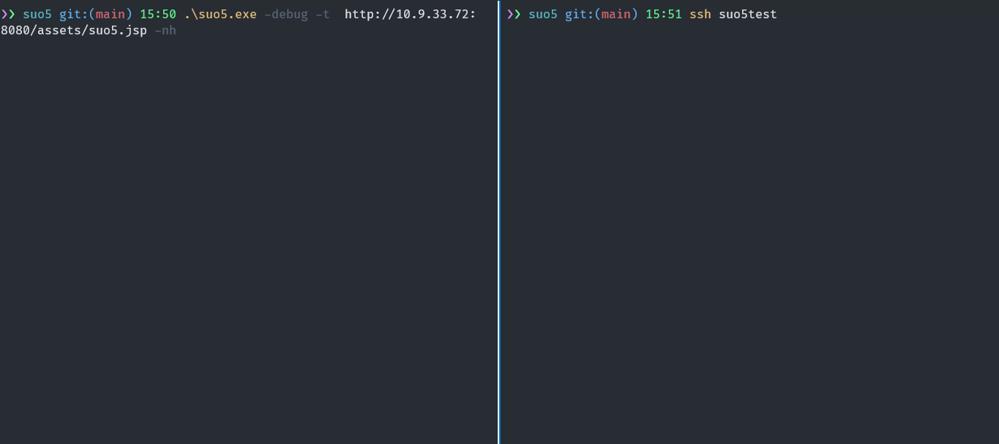
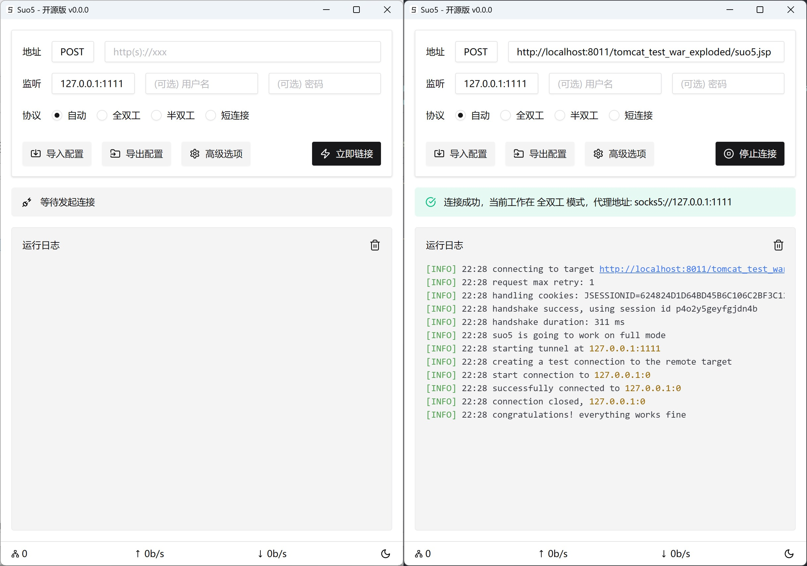

<h1 align="center">Suo5</h1>

<p align="center">高性能 HTTP 正向代理工具</p>

<div align="center">


</div>




> [!WARNING]
> 本工具仅供安全研究人员、网络管理员及相关技术人员进行授权的安全测试、漏洞评估和安全审计工作使用。使用本工具进行任何未经授权的网络攻击或渗透测试等行为均属违法，使用者需自行承担相应的法律责任。

## 简介

Suo5 是一款久经实战检验的高性能 HTTP 正向代理工具，历时三年持续打磨只为解决一个需求：不出网场景下的稳定正向代理。

其主要特点包括：

- **优异的传输性能**
    - 全双工: 借助双向 Chunked-Encoding 实现单连接双向通信，传输性能接近 FRP
    - 半双工: 下行长连接+上行短连接实现，在 Nginx 反代场景下仍可保持良好性能
    - 短链接: 上下行均使用短连接，适配多层反代和严格限制长连接的场景，作为兜底方案
- **良好的服务端兼容性**
    - Java 支持 Tomcat、WebLogic、JBoss、Resin 等主流中间件, JDK6 ~ JDK 2x 全版本支持
    - .Net 支持 IIS 下所有 .Net Framework 版本 (>=2.0)
    - PHP 支持 Nginx/Apache 等服务器环境, PHP 5.6 ~ PHP 8.x 全版本支持
- **复杂网络环境支持**
    - 支持一层、两层、多层反向代理下的稳定连接
    - 支持通过流量转发和请求重试来支持负载均衡场景
    - 支持配置上游代理（HTTP/SOCKS5）
- **稳定可靠的工程实现**
    - 正确可靠的连接控制、并发管理、心跳保活、异常重连等
    - 完善的单元测试和集成测试保障质量

## 快速开始

### 1. 下载客户端

前往 [Releases](https://github.com/zema1/suo5/releases) 下载对应平台的二进制文件：

- `suo5-gui-*` - 图形界面版本 (推荐)
- `suo5-cli-*` - 命令行版本

支持平台：Windows、macOS (Intel/Apple Silicon)、Linux

### 2. 部署服务端

将 [assets](./assets/) 目录下对应的服务端文件上传到目标服务器并确认可以正常执行。实战建议使用内存马版本以实现更好的隐蔽性。

### 3. 连接服务端

Suo5 针对 `auto` 模式（默认）做了大量的优化，大多数时候你无需复杂参数配置，仅使用 `-t` 指定服务端
URL，即可自动确认目标支持的通信模式并在本地启动代理服务：

```bash
$ ./suo5 -t http://target.com/suo5.jsp
...
[INFO] 14:28 connecting to target http://target.com/suo5.jsp
[INFO] 14:28 preferred connection mode: half
[INFO] 14:28 handshake success, using session id 05q21upecl90yccl
[INFO] 14:28 suo5 is going to work on half mode
[INFO] 14:28 starting tunnel at 127.0.0.1:1111
[INFO] 14:28 creating a test connection to the remote target
[INFO] 14:28 start connection to 127.0.0.1:0
[INFO] 14:28 successfully connected to 127.0.0.1:0
[INFO] 14:28 connection closed, 127.0.0.1:0
[INFO] 14:28 congratulations! everything works fine
```

连接成功后会在本地 `127.0.0.1:1111` 开启 SOCKS5 代理服务，使用该代理会让流量从远程服务器转发出去。

```
curl -x socks5h://127.0.0.1:1111 http://internal.target.com
```

实战建议搭配 [ProxyCap](https://www.proxycap.com/) 或 [Proxifier](https://www.proxifier.com/) 等工具，将指定应用的流量通过该代理转发。

## 客户端

GUI 版基于 [Wails](https://github.com/wailsapp/wails) 构建，支持 Windows 和 macOS 和 Linux
三大主流系统。针对日常使用习惯做了大量改进优化，界面功能简洁易懂，推荐大多数用户使用此版本。

> 该实现依赖系统的 Webview 框架, Windows 11 和 MacOS 已自带该组件，其他系统会弹框请允许下载安装，否则无法使用。



CLI 版本适合喜欢命令行操作的用户，或需要在服务器上运行的场景。

```bash
$ ./suo5 -h

USAGE:
   suo5 [global options] command [command options]

GLOBAL OPTIONS:
   --config value, -c value                                               the filepath for json config file
   --target value, -t value                                               the remote server url, ex: http://localhost:8080/suo5.jsp
   --listen value, -l value                                               listen address of socks5 server (default: "127.0.0.1:1111")
   --method value, -m value                                               http request method (default: "POST")
   --redirect value, -r value                                             redirect to the url if host not matched, used to bypass load balance
   --auth value                                                           socks5 creds, username:password, leave empty to auto generate
   --mode value                                                           connection mode, choices are auto, full, half, classic (default: "auto")
   --header value, -H value [ --header value, -H value ]                  use extra header, ex -H 'Cookie: abc'
   --ua value                                                             shortcut to set the request User-Agent
   --timeout value                                                        request timeout in seconds (default: 5)
   --max-body-size value, -S value                                        request max body size (default: 524288)
   --retry value                                                          request retry (default: 1)
   --classic-poll-qps value, --qps value                                  request poll qps, only used in classic mode (default: 6)
   --classic-poll-interval value, --qi value                              request poll interval in milliseconds, only used in classic mode (default: 200)
   --proxy value [ --proxy value ]                                        set upstream proxy, support socks5/http(s), eg: socks5://127.0.0.1:7890
   --debug, -d                                                            debug the traffic, print more details (default: false)
   --no-heartbeat, --nh                                                   disable heartbeat to the remote server which will send data every 5s (default: false)
   --no-gzip, --ng                                                        disable gzip compression, which will improve compatibility with some old servers (default: false)
   --jar                                                                  enable cookiejar (default: false)
   --no-browser-headers, --nb                                             disable browser headers, which will not send Accept, Accept-Encoding, etc. (default: false)
   --exclude-domain value, -E value [ --exclude-domain value, -E value ]  exclude certain domain name for proxy, ex -E 'portswigger.net'
   --exclude-domain-file value, --ef value                                exclude certain domains for proxy in a file, one domain per line
   --forward value, -f value                                              forward target address, enable forward mode when specified
   --help, -h                                                             show help
   --version, -v                                                          print the version
```

## 传输模式对比

Suo5 提供四种传输模式，以适应不同的网络环境和中间件限制：

|   模式    | 原理                          | 延迟 | 吞吐量 | 适用场景               |
|:-------:|:----------------------------|:--:|:---:|:-------------------|
| **自动**  | 自动探测并选择最佳模式                 | -  |  -  | 默认推荐，适合大多数场景       |
| **全双工** | 双向 Chunked-Encoding，单连接双向通信 | 极低 | 极高  | 直连或简单反代，性能最佳       |
| **半双工** | 下行长连接 + 上行短连接               | 低  |  高  | Nginx 反代、部分 WAF 场景 |
| **短连接** | 上下行均为短连接 + 轮询               | 中  |  中  | 多层反代、严格限制长连接的环境    |

## 使用指南

为了方便说明，指南部分均使用命令行版本进行演示，GUI 版本功能完全一致且更易使用。

### 基本用法

```bash
# 自动检测最佳传输模式
./suo5 -t https://target.com/suo5.jsp

# 指定 HTTP 请求方法为 GET, 默认 POST
./suo5 -m GET -t https://target.com/suo5.jsp

# 修改 Socks5 监听地址和端口, 并设置认证信息。 默认监听 127.0.0.1:1111，无认证
./suo5 -t https://target.com/suo5.jsp -l 0.0.0.0:7788 --auth user:pass123

# 设置上游代理
# 特别注意! 仅短链接模式支持在 Burp 中抓包，其他模式会导致连接异常
./suo5 -t https://target.com/suo5.jsp --proxy socks5://127.0.0.1:7890
./suo5 -t https://target.com/suo5.jsp --proxy http://127.0.0.1:8080
```

### 负载均衡场景

当目标存在负载均衡时，需在所有后端部署服务端，并指定重定向 URL：

```bash
./suo5 -t https://target.com/suo5.jsp -r http://172.0.3.2/suo5.jsp
```

原理：判断 `-r` 中 URL 的 IP 是否与服务器网卡 IP 匹配，不匹配则转发请求。

### 域名过滤

避免特定域名走代理：

```bash
# 直接指定域名
./suo5 -t https://target.com/suo5.jsp -E example.com -E google.com

# 使用域名列表文件（一行一个）
./suo5 -t https://target.com/suo5.jsp -ef ./excludes.txt
```

> **注意**：确保代理请求中包含域名而非 IP。使用 `socks5h://` 协议让 DNS 解析在代理端进行：
> ```bash
> curl -x socks5h://127.0.0.1:1111 https://example.com
> ```

### 端口转发模式

直接转发 TCP 端口（非 SOCKS5 模式）：

```bash
# 将本地 1111 端口转发到目标内网的 MySQL
./suo5 -t https://target.com/suo5.jsp -f 172.16.0.10:3306
```

### 启用 Cookie Jar

保持会话 Cookie，某些服务端可能需要：

```bash
./suo5 -t https://target.com/suo5.jsp --jar
```

### 使用配置文件

支持通过 JSON 配置文件管理参数，GUI 和 CLI 配置格式完全兼容：

```json
{
  "method": "POST",
  "listen": "127.0.0.1:1111",
  "target": "https://target.com/suo5.jsp",
  "no_auth": true,
  "username": "",
  "password": "",
  "mode": "auto",
  "buffer_size": 327680,
  "timeout": 10,
  "debug": false,
  "upstream_proxy": "",
  "redirect_url": "",
  "raw_header": [
    "User-Agent: Mozilla/5.0 (Linux; Android 6.0; Nexus 5 Build/MRA58N) AppleWebKit/537.36"
  ],
  "disable_heartbeat": false,
  "disable_gzip": false,
  "disable_cookiejar": true,
  "exclude_domain": null
}
```

使用配置文件：

```bash
# CLI 加载配置
./suo5 -c config.json

# GUI 可通过界面导入/导出配置
```

## 常见问题

**Q: 密码/认证功能**

Suo5 的 `--auth` 参数用于设置**本地 SOCKS5 代理**的认证，格式为 `username:password`。这是为了防止本地代理被未授权使用，与服务端无关。

```bash
# 设置 SOCKS5 认证
./suo5 -t https://target.com/suo5.jsp --auth admin:P@ssw0rd

# 使用时需要带上认证信息
curl -x socks5h://admin:P@ssw0rd@127.0.0.1:1111 http://internal.com
```

服务端脚本本身不含密码保护功能。如需保护服务端，建议：

- 修改服务端文件名和路径
- 使用内存马自带的准入规则实现

**Q: 如何在 Burp 中抓包调试？**

仅**短连接模式**支持在 Burp 中抓包，其他模式的长连接会导致 Burp 无法正常处理：

```bash
./suo5 -t https://target.com/suo5.jsp --mode classic --proxy http://127.0.0.1:8080
```

**Q: 如何选择传输模式？**

推荐使用默认的 `auto` 模式，客户端会自动探测最佳模式。如果自动探测不准确，可以手动指定：

- 直连或简单反代 → `--mode full`
- Nginx 反代 → `--mode half`
- 多层反代/CDN/严格环境 → `--mode classic`

## 参考项目

- [Chunk-Proxy](https://github.com/BeichenDream/Chunk-Proxy)
- [Neo-reGeorg](https://github.com/L-codes/Neo-reGeorg)
