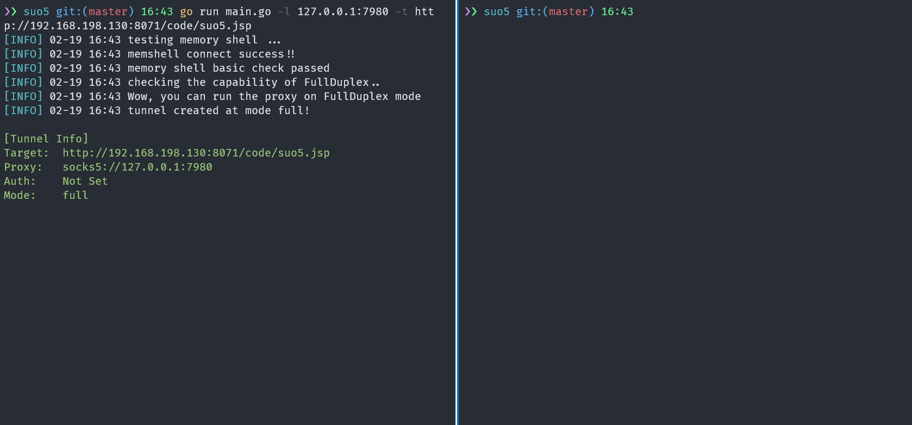

<h1 align="center">Suo5</h1>

<p align="center">A high-performance http proxy tunneling tool</p>

<div align="center">


</div>



[中文](./README.md) | [English](./README_EN.md)

----

`suo5` is a new HTTP proxy tunnel built on the `Chunked-Encoding` of `HTTP/1.1`.
Compared to traditional tunneling tools like [Neo-reGeorg](https://github.com/L-codes/Neo-reGeorg),
`suo5` offers performance that is several times higher. Check out the [performance tests](./tests)

Its key features include:

- Bidirectional data transmission through a single connection
- Support for both full-duplex and half-duplex modes, and automatically selects the best mode
- Supports use in Nginx reverse proxy scenarios
- Own data serialization protocol, with encrypted data transmission
- Robust connection control and concurrency management, smooth and silky
- Implementation based on native `Servlet`, with full compatibility across JDK6~JDK19 versions.
- Both command line and graphical interfaces are provided

The reference the
principle: [https://koalr.me/posts/suo5-a-hign-performace-http-socks/](https://koalr.me/posts/suo5-a-hign-performace-http-socks/)

## Install and run

Go to [Releases](https://github.com/zema1/suo5/releases) to download the compiled binary, where the version with `gui`
is the GUI version and the one without `gui` is the command line version. All compilations are automatically built by
Github Action, feel free to use them.

To use it, you need to upload [suo5.jsp](. /assets/) to the target server and make sure it is runnable.

### GUI App

The GUI version is based on [wails](https://github.com/wailsapp/wails) which relies on the Webview2 framework.
Windows 11 and MacOS already come with this component, other systems will have a popup box to download and install it.


### Command line

```text
NAME:
   suo5 - A super http proxy tunnel

USAGE:
   suo5 [global options] command [command options] [arguments...]

VERSION:
   v0.3.0

COMMANDS:
   help, h Shows a list of commands or help for one command

GLOBAL OPTIONS:
   --target value, -t value set the remote server url, ex: http://localhost:8080/tomcat_debug_war_exploded/
   --listen value, -l value set the listen address of socks5 server (default: "127.0.0.1:1111")
   --method value, -m value http request method (default: "POST")
   --no-auth disable socks5 authentication (default: true)
   --auth value socks5 creds, username:password, leave empty to auto generate
   --mode value connection mode, choices are auto, full, half (default: "auto")
   --ua value the user-agent used to send request (default: "Mozilla/5.0 (Linux; Android 6.0; Nexus 5 Build/MRA58N) AppleWebKit/537.36 (KHTML, like Gecko) Chrome/109.1.2.3")
   --timeout value http request timeout in seconds (default: 10)
   --buf-size value set the request max body size (default: 327680)
   --proxy value use upstream socks5 proxy
   --debug, -d debug the traffic, print more details (default: false)
   --help, -h show help
   --version, -v print the version
```

The command line version is exactly the same as the GUI version, You can refer to the GUI version to use it. The
simplest use is to simply specify the connection target.

```bash
$ ./suo5 -t https://example.com/proxy.jsp
```

Sending requests using the ``GET`` method which sometimes can bypass restrictions

```bash
$ ./suo5 -m GET -t https://example.com/proxy.jsp
```

set the socks5 server listen on `0.0.0.0:7788` and set the authentication to `test:test123`

```bash
$ ./suo5 -t https://example.com/proxy.jsp -l 0.0.0.0:7788 --auth test:test123
```

### Notice

The `User-Agent` (`ua`) configuration is bound to the server side, if you modify one of them, the other one must be
modified to connect as well.

## Frequently Asked Questions

1. What is full-duplex and half-duplex?

   **Full-duplex** An HTTP tunnel can be constructed by sending a single HTTP request, enabling bi-directional communication over TCP. This request can be interpreted as both an upload and a download request, it will keep downloading and uploading, so it can be used for bi-directional communication.

   **Half-duplex** In some scenarios where `full-duplex` mode is not supported (e.g., there is a reverse proxy),
   it will fall back to half-duplex mode, send a request to build a downstream tunnel, and use the general http request to send upstream data.

2. `suo5` vs `Neo-reGeorg`?

   If the target is a Java site, you can use `suo5` to build an http tunnel, and in most cases `suo5` is more stable and
   faster than `neo`. However, `neo` provides a variety of server support, and also
   supports some features that `suo5` is currently developing, such as load balancing, and also has more flexible customization.

## Next

- [x] support for configuring upstream socks proxy
- [ ] Support load balancing scenarios
- [ ] Support for .net

## Reference

- [https://github.com/L-codes/Neo-reGeorg](https://github.com/L-codes/Neo-reGeorg)
- [https://github.com/BeichenDream/Chunk-Proxy](https://github.com/BeichenDream/Chunk-Proxy)